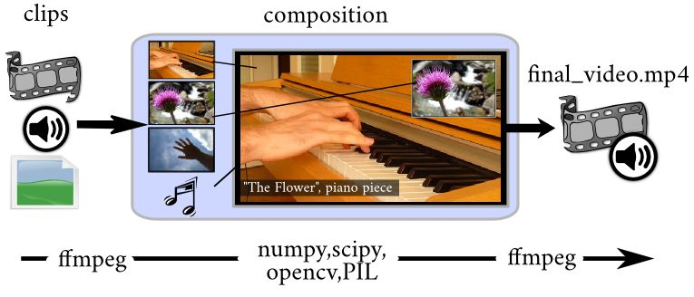

:title: A Primer on FFmpeg and Video Compression
:author: Dean Silfen
:description: Some quick words on how to compress video for the internet.
:keywords: presentation, restructuredtext, impress.js, tutorial
:css: main.css

----

A Primer on FFmpeg and Video Compression
========================================

By Dean Silfen
--------------

Github_ & LinkedIn_

.. _Github: https://github.com/djds23

.. _LinkedIn: https://www.linkedin.com/pub/dean-silfen/50/327/339 

----

A BigApplePy Thanks!
====================

Thank you to the BigApplePy Organisers, Volunteers and Sponsors!

Thank you to all the maintaners of open source projects like FFmpeg, PIL, Pillow, and Mediainfo!

Thank you to Zulko for MoviePy and his help in my research!

----

Anatomy of your average video file:
===================================

Container (File suffix, .mp4, .ogg, .webm)

    -Video Codec: Theora / VP8 / h.264

    -Audio Codec: Vorbis / MP3 / AAC

    -General Metadata: Format, Writing Library, filesize, etc.

----

Lossy vs Lossless Compression
=============================

----

Group of Picture Compression
============================

Make smaller videos by recycling data from past and future frames. 
    
    - Divide the video into 3 different types of frames.
        
        - *I*-frames (key frames) contain all data needed to recreate an image. An I-frame stands alone as a complete image with no data missing.

        - *P*-frames (predicted frames) are  partial images that *reference* other P or I frames before them to create full images. 

        - *B* frames (bi-directional frames) partial images that draw data from the P and I frames in either direction to make them whole 

    - *P* & *B* frames are both versions of interframe compression while *I* frames are versions of intraframe compression

----

Which codecs to chose?
======================

----

h.264! (non-free)
=================
VPX! (royalty-free!)
====================
Theora! (BSD-style License)
===========================

----

Tools?
======

FFmpeg_
Mediainfo_
Moviepy_ (numpy, PIL, Wand, FFMPEG & more!)

.. _FFmpeg: https://www.ffmpeg.org/
.. _Mediainfo: http://mediaarea.net/en/MediaInfo
.. _Moviepy: http://zulko.github.io/moviepy/

----

When making FFmpeg scripts, beware of the internet!
===================================================

Searching a particular use case does not always yield the best results for FFmpeg!

Be careful about copying and pasting a command from the internet!

It is generally best to look directly at the FFmpeg documents!

----

Basic input:
============

Your typical FFmpeg script looks like this:

``ffmpeg -i input.mp4 -c:a copy -c:v copy output.mp4``

The ``-c:a`` and ``-c:v`` stand for audio and videos codecs respectively.

----

More advanced input:
====================

::

  -s (size)
  -f (format)
  -v (verbosity)
  -r (framerate)
  -t (duration in seconds)
  -metadata (key=value)
  -frames:v (limit number of frames)
  -an (no audio)
  -vn (no video)
  -y (overwrite existing video without prompts)
  -pix_fmt (used to accomadate colorspace)

----

Slightly more complex commands!
===============================

Here is an example script for simply converting a file to h.264

::

     ffmpeg -i input.mp4 -c:a copy -c:v libx264 -r 24 -frames:v 24 output.mp4

----

Presets
=======

Trust in the presets! They are there for a reason!

Take a look at them here:

`FFmpeg X264 Encoding Guide`__

.. _Guide: https://trac.ffmpeg.org/wiki/x264EncodingGuide

__ Guide_

``-presets (option)`` will set up your encoding preset

``-tune (option)`` cater to your specific video, animation, film, fastdecode

----

Lets build more complex commands!
=================================

We have a rawvideo file that came from a capture, this file is quite large and will not play properly in all players. Lets transcode it to h.264 to make it smaller! 

----

::

    ffmpeg\
    -y\
    -f rawvideo\
    -c:v rawvideo\
    -pix_fmt rgb24\
    -r 60\
    -i input.mp4\
    -preset slow\
    -an\
    -c:v libx264\
    -pix_fmt yuv420p\
    -r 24\
    output.mp4

----

Now lets inspect our video alittle bit
======================================

Using mediainfo we can read out the information held in the container of the file.

::

    General
    Complete name                            : output.mp4
    Format                                   : MPEG-4
    Format profile                           : Base Media

...

::

    Video
    ID                                       : 1
    Format                                   : AVC
    Format/Info                              : Advanced Video Codec

----

Mediainfo continued...

::

    Width                                    : 1 280 pixels
    Height                                   : 720 pixels
    Display aspect ratio                     : 16:9
    Frame rate mode                          : Constant
    Frame rate                               : 24.000 fps
    Color space                              : YUV
    Chroma subsampling                       : 4:2:0
    Bit depth                                : 8 bits
    Scan type                                : Progressive
    Writing library                          : x264 core 142

Looks pretty good right?

----

Now lets starting building videos with Python!
==============================================

----

``pip install moviepy``

This will take a while! numpy is quite a large dependency.

----

What is MoviePy exactly and what can I do with it?
==================================================

----

A note on Objects
=================

Moviepy has wonderful use of inheritence to provide many different features to all different kinds of clips.

Every Clip object has access to the .fx, a start position, end position, subclip and duration(and more!).

The base Clip object is then inherited by VideoClip, which serves as a base for ImageClip, TextClip and CompositeVideoClip.

If you start crawling through the source you will see a really nice pattern of inheritence quickly pop up.

This makes navigating the source code quite plesant.

----

Hello, World!

.. code-block:: python

    >>> import moviepy.editor as moviepy
    >>> hello_world = TextClip('Hello, World!', fontsize=78, color='white', size=(1280,720))
    >>> hello_world = hello_world.set_duration(10)
    >>> hello_world.write_videofile('hello_world.avi', fps=24)

you can replace the last line with ``write_videofile('hello_world.webm', fps=24, codec=libvpx`` and it will still work!

----

.. image:: media/hello_world.webm

----

Generate graphic elements with MoviePy
======================================

Lets say we have formatted text that we want to make a slideshow out of, why not use moviepy?

Say these were Tweets? How would we do that?

----

Big thanks to Zulko for the next two slides!

Lets assume we have an array of tweets...

.. code-block:: python

    texts = [moviepy.TextClip(tweet, fontsize=23,
                      font="Amiri-Bold", align="center")
            .set_duration(len(tweet)*.065)
            .set_pos("center")
            .crossfadein(.2)
            .crossfadeout(.2)
            for tweet in tweets]

Now we have a list of TextClip objects that have nice fades on them!

Also note the use of fonts, they come with ImageMagick.

----

More code...

.. code-block:: python

    textclips = [moviepy.CompositeVideoClip(
                   [signature, text], size=SIZE, bg_color=(233,229,90))
                  .set_duration(text.duration)
                 for text in texts]

CompositeVideoClips feature the text on top of a nice banana yello background.

.. code-block:: python

    final = moviepy.concatenate(textclips)

This joins all the clips to one CompositeVideoClip object, joined one after another.

.. code-block:: python

    final.write_videofile('output.mp4')

and we write the output to a file!

----

How do we actually output to a file?
====================================

Take a peak at ``moviepy/video/io/ffmpeg_writer.py``.

Does this look familiar?

.. code-block:: python

    cmd = (
            [ FFMPEG_BINARY, '-y',
            "-loglevel", "error" if logfile==sp.PIPE else "info",
            "-f", 'rawvideo',
            "-vcodec","rawvideo",
            '-s', "%dx%d"%(size[0],size[1]),
            '-pix_fmt', "rgba" if withmask else "rgb24",
            '-r', "%.02f"%fps,
            '-i', '-', '-an',
            '-vcodec', codec,
            '-preset', preset]
            + (['-b',bitrate] if (bitrate!=None) else [])

            # http://trac.ffmpeg.org/ticket/658
            + (['-pix_fmt', 'yuv420p']
                  if ((codec == 'libx264') and
                     (size[0]%2 == 0) and
                     (size[1]%2 == 0))
               else [])
            + [ '-r', "%d"%fps, filename ]
            )

        self.proc = sp.Popen(cmd, stdin=sp.PIPE,
                                  stderr=logfile,
                                  stdout=DEVNULL)

----

Can we apply this to an application?

.. code-block:: python

    import textwrap
    import moviepy.editor as moviepy

    def make_element(quote, author, size):
    signature = (moviepy.TextClip("- %s"%author, fontsize=30,
                               color='gray',)
                               #font="Amiri-Slanted")
                  .margin(right=30, bottom=30, opacity=0)
                  .set_pos(("right","bottom")))
    quote = '\n'.join(textwrap.wrap(quote))
    quote_clip = (moviepy.TextClip(quote, fontsize=23,
                          font="Amiri-Bold", align="center")
                            .set_duration(len(quote)*.065)
                            .set_pos("center")
                            .crossfadein(.2)
                            .crossfadeout(.2))
    element = (moviepy.CompositeVideoClip(
                   [signature, quote_clip], size=size, bg_color=(233,229,90))
                    .set_duration(quote_clip.duration))
    return element

----

Why not?

.. code-block:: python

    author = request.form['author']
    quote = request.form['quote']
    size = (int(request.form['width']),int(request.form['height']))
    element = make_element(quote, author, size)
    destination = 'static'
    supported_codecs = [('libx264', '.mp4'),
                        ('libvpx','.webm'),
                        ('libtheora','.ogg')]
    context = []
    for codec in supported_codecs:
        filename = author + codec[1]
        element.write_videofile(filename,
                                codec=codec[0],
                                fps=24)
        shutil.move(filename, destination)
        context.append({'filename' : filename,
                        'suffix': codec[1]})
    return render_template('video.html', videos=context)

----

.. image:: media/text_element.webm

----

A prettier Twitter example using PIL and moviepy, take a peak at the code here_!

.. _here: https://github.com/djds23/element_gen

----

.. image:: media/dontusethiscode_large.webm

----

More great projects with Moviepy!
=================================

Videogrep_ reads subtitle files and uses moviepy to create "supercuts" of a certain word or grammer structure using the Pattern_ library

Rinconcam_ uses Open_CV_ to track surfers on a pan/tilt/zoom camera, then chooses the best videos of the day and posts them on the Rinconcam website. Those videos are edited and exported using Moviepy_!

.. _Open_CV: http://opencv.org/
.. _Rinconcam: http://www.rinconcam.com
.. _Pattern: http://www.clips.ua.ac.be/pattern
.. _Videogrep: http://lav.io/2014/06/videogrep-automatic-supercuts-with-python/ 

----

.. image:: media/riconcam.webm

----

Advanced FFmpeg, Lets get CRF-ty
================================

Bandwidth can be expensive, use these methods to trim your bitrate!

Constant Rate Factor compress similar frames a similar amount.

::

    -crf (quantization number between 0 for best quality and 51 for worst)

Multipass encoding creates a reference file for better look ahead data!

::

    -pass 1 (first pass)
    -pass 2 (second pass)

Combine this with ``-b:v (bitrate)`` for a target bitrate to compress video for best results.

----

Filters
=======

``-vf`` applies a video filter

``scale:width:height:flags=lanczos`` for more effcient resizing

You can also use Moviepy to resize clips!

.. code-block:: python

    #pass it a scaling factor
    clip.resize(.5)

    #width/height tuple
    clip.resize((960,540))

    #function that returns a valid reponse
    clip.resize(lambda s: (s/2, s/2))

    #height or width can be passed, will compute to conserve width/height ratio
    clip.resize(width=540)

``yadif=0:-1:0`` yet another deinterlacing filter...

----

libx264 bindings vs FFmpeg bindings
===================================

libx264 has more options than FFmpeg has flags!

``-x264opts (key=value:key=value)``

----

Experiment!
============

Inspect your videos using a tool like Mediainfo, and see what your presets did, then tweak accordingly.

----

Fun use cases
=============

``-v:c prores -profile:v 1`` creates edit friendly prores files!

``-vf scale:612:612:flags=lanczos`` for instagram!

Recoding video from a webcam with ``-i /dev/video0``

Create a streaming server with ffserver! (Linux only!)

----

Links/References
================

-http://zulko.github.io/moviepy

-http://www.theora.org/

-http://www.webmproject.org/

-http://trac.ffmpeg.org/wiki/CompilationGuide

-https://trac.ffmpeg.org/wiki/x264EncodingGuide

-http://www.ffmpeg.org/ffmpeg-all.html

-https://trac.ffmpeg.org/wiki/vpxEncodingGuide

-https://trac.ffmpeg.org/wiki/Streaming%20media%20with%20ffserver

-http://avisynth.org.ru/yadif/yadif.html

-http://documentation.apple.com/en/finalcutpro/usermanual/index.html#chapter=C%26section=12%26tasks=true

-http://www.xiph.org/video/vid1.shtml

-http://flask.pocoo.org/
